## DigiKaan is an online store where users can buy different products of different categories.

## Description 
It is created using Node Js, Typescript, React Js, Redux, MongoDB, Firebase, Express Js, Saas and Stripe for payment gateway. It is a full stack application where users are authenticated with Firebase and their information is stored in MongoDB. There are two types of users. One is admin and other is customer. Admin can list the products, delete products/users, update products and also update the status of products like Shipped, Delivered etc. Customers have to login and search for their products after this they add the desired products to cart. Then they go to cart and Checkout from there. The order is finally placed after entering the shipping details and payment details.

## Admin's Dashboard 

#### Analyse everything
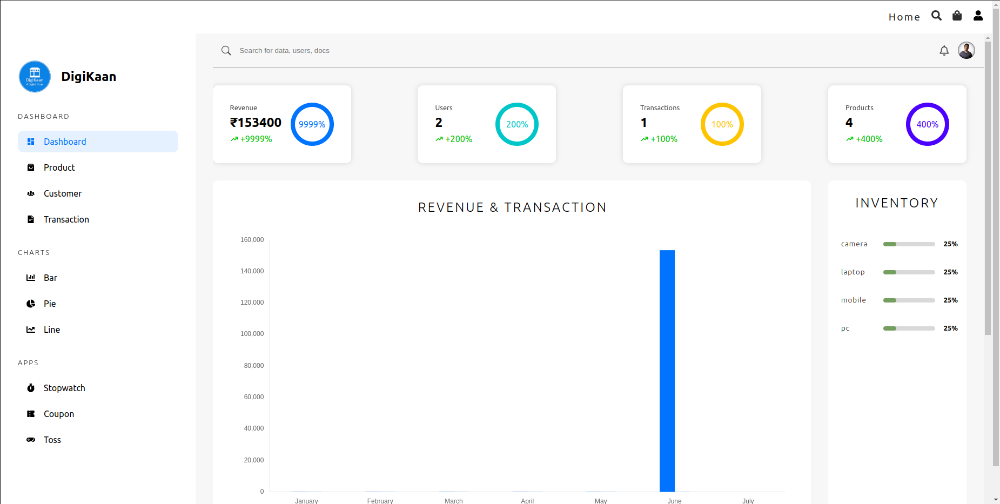
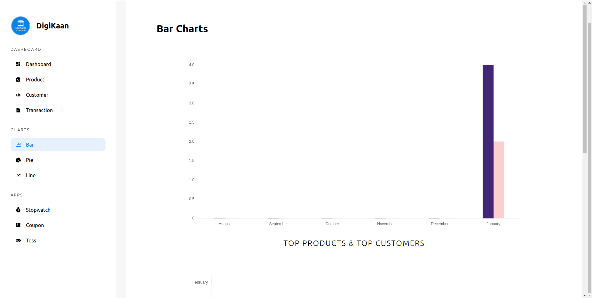
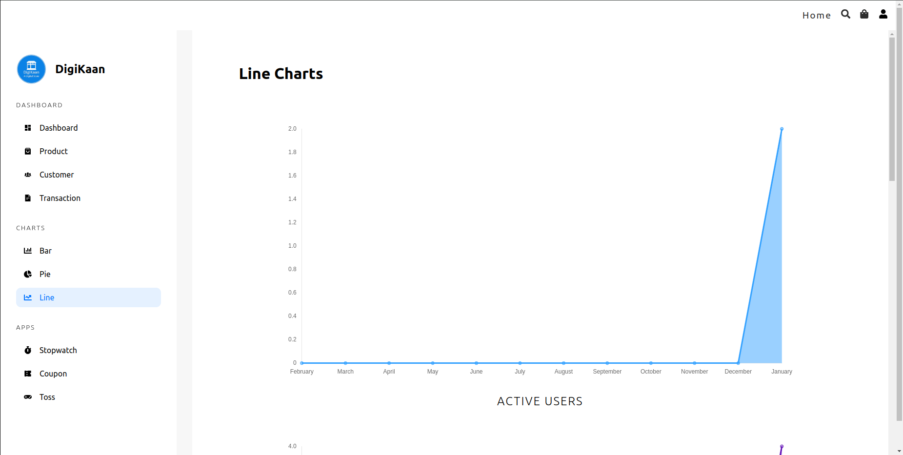
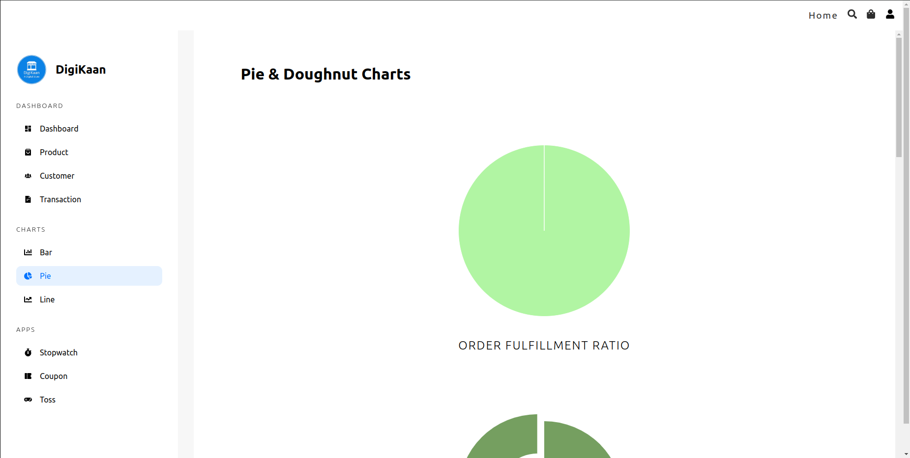

#### Manage Products
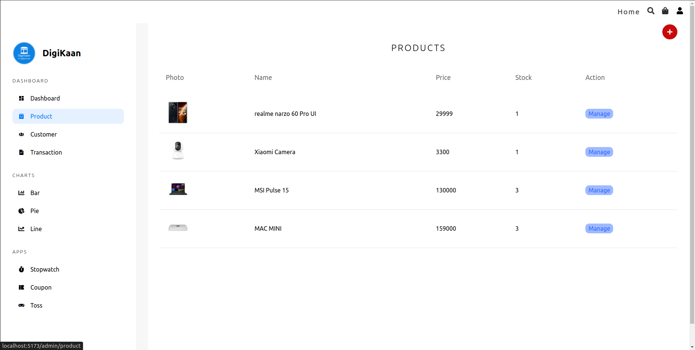
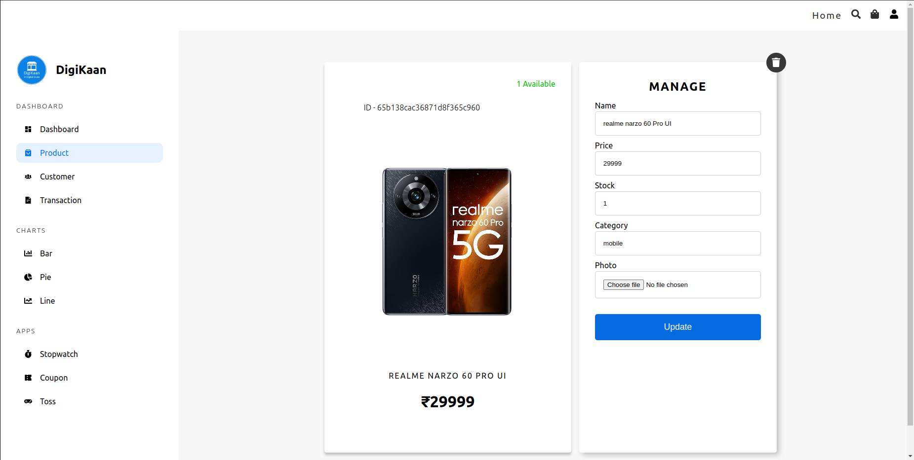

#### Manage Users
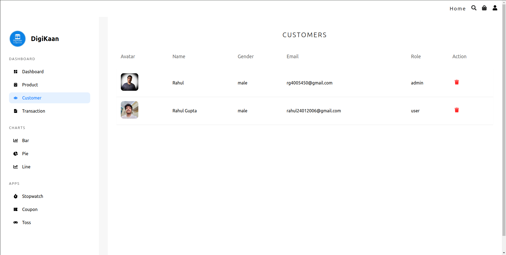

#### See Transactions
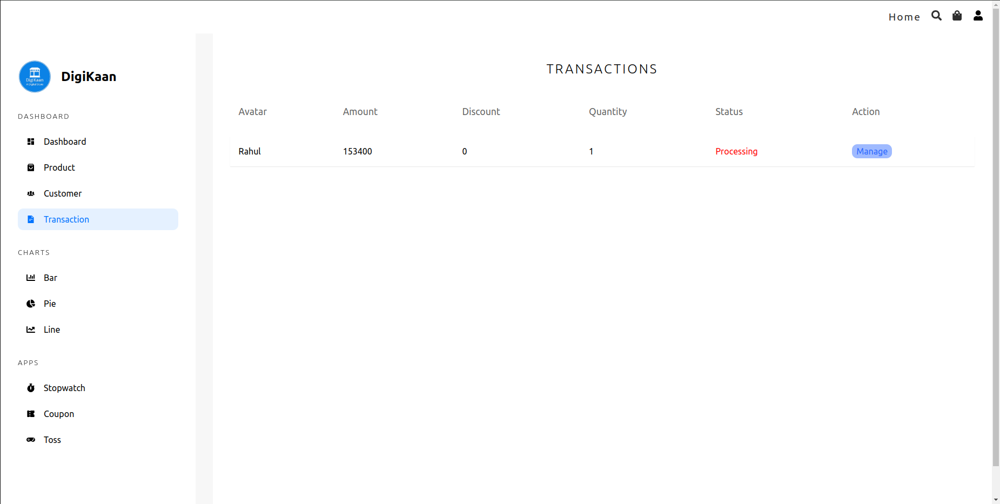

#### Manage Order
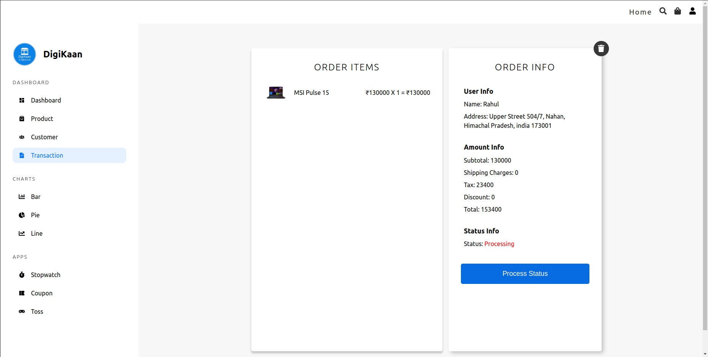

#### Relax Yourself!
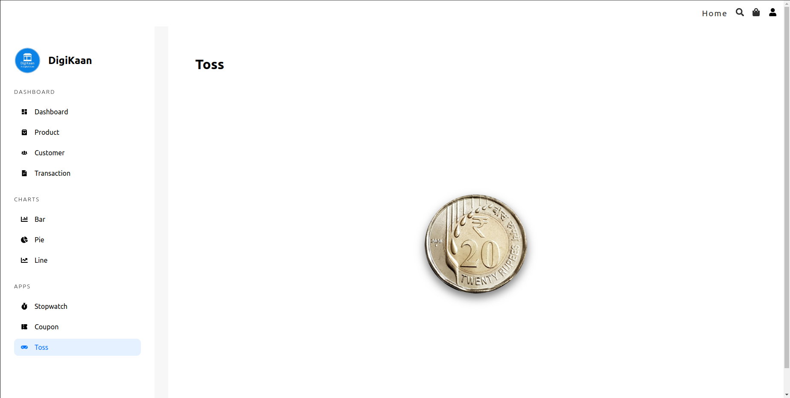
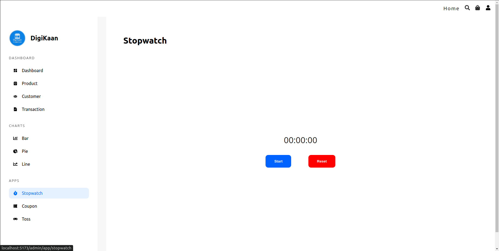

## What your customers will see?
#### Home
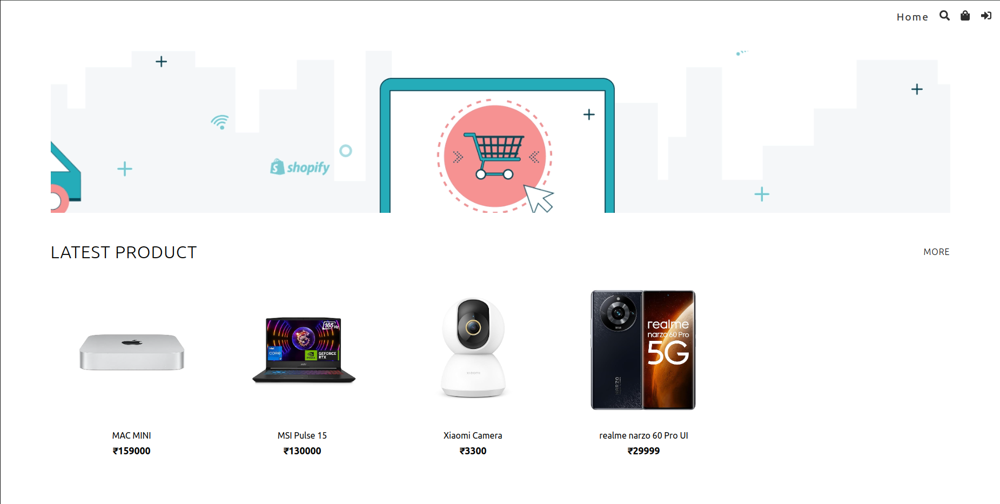
#### Product Info Page
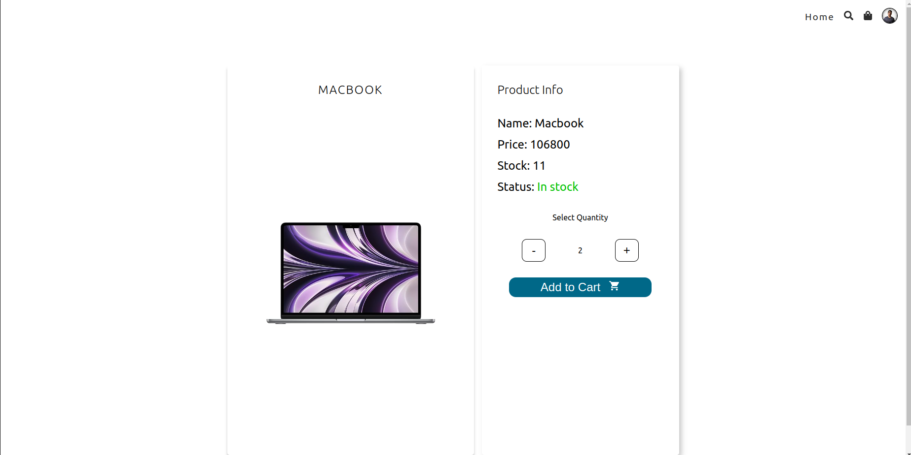
#### Search
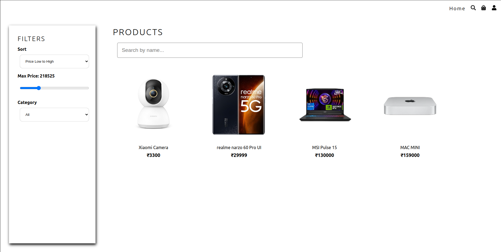
#### Cart
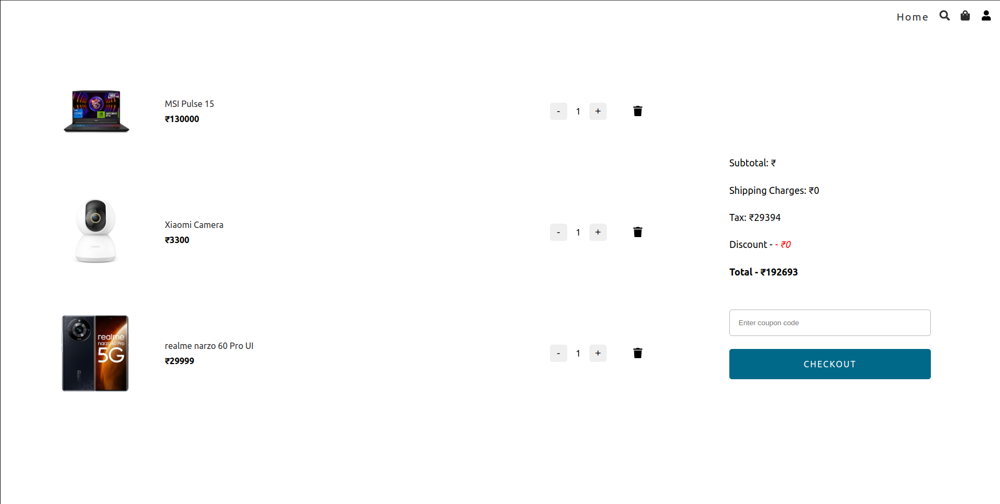
#### Shipping Details
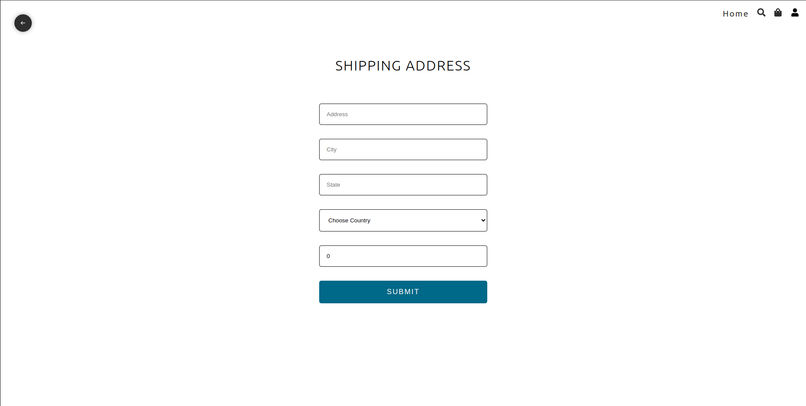
#### Payment
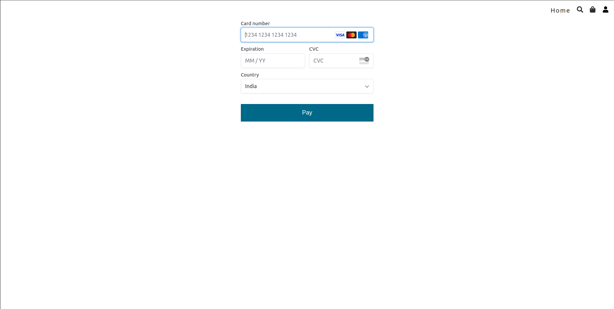
#### Your Orders 
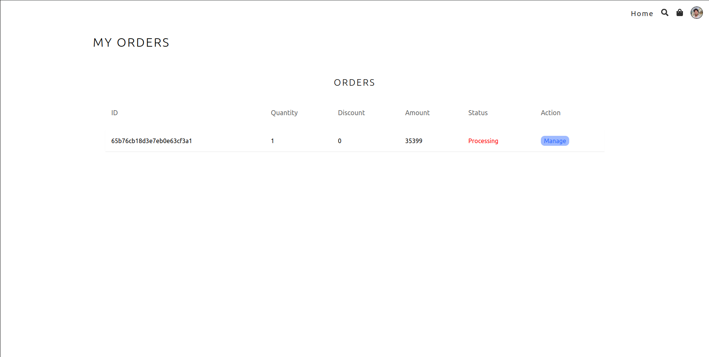

## Setup Guide

#### Server Setup

1. Open the terminal in `server`folder and run `npm install`

2. Create a new `.env` file in server folder and add the environment variables as mentioned in `.env.sample` file

3. Please create and `uploads` folder in root directory

4. Run `npm run dev` to start the server

#### Frontend Setup

1. Open terminal `client` folder and run `npm install`

2.  Create a new `.env` file in client folder and add the environment variables as mentioned in `.env.sample` file

3. Run `npm run dev` to start the frontend

## Author's Social Links 🖥️

- [Twitter](https://twitter.com/rahu__24)
- [LinkedIn](https://www.linkedin.com/in/rahu24/)
- [Instagram](https://www.instagram.com/rahu__24/)
